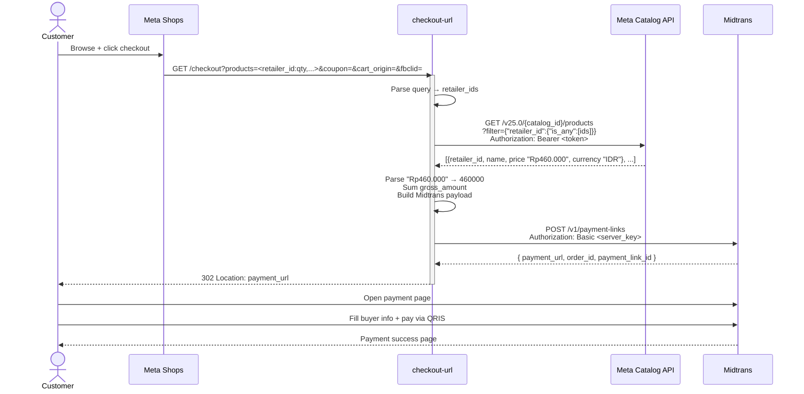

# checkout-url

Service Go + Fiber v3 yang nerima redirect dari Facebook/Instagram Shops checkout, fetch nama + harga product real-time dari **Meta Commerce Catalog**, bikin Midtrans Payment Link, lalu `302` redirect customer ke `payment_url`.

Overview repo + workflow: [CLAUDE.md di root](../../CLAUDE.md).

## Request flow



**Key design notes:**

- **No catalog cache** — always fresh fetch per checkout (catalog churn is high; stale risk > latency cost).
- **No `customer_details` sent to Midtrans** — sandbox rejects empty/partial; `customer_required: true` alone surfaces the buyer form.
- **Bearer header for Meta**, not query param — keeps token out of paginated URLs Meta echoes back.
- **Single bulk fetch** — 1 Graph API call regardless of cart size (1-5 typical), via `is_any` filter.
- **IDR-only** — price parsing strips `"Rp"` and `"."` (thousand separator).

## Setup

```bash
cp .env.example .env
# isi:
#   - MIDTRANS_SERVER_KEY / CLIENT_KEY / MERCHANT_ID dari sandbox dashboard
#   - META_CATALOG_ID dari Commerce Manager → Catalog → Settings
#   - META_ACCESS_TOKEN: System User token dengan scope catalog_management
#     (Business Manager → Business Settings → System Users → Generate New Token)
go run ./cmd/server
```

## Endpoints

- `GET /health` — liveness check
- `GET /checkout?products=<retailer_id:qty,retailer_id:qty>&coupon=&cart_origin=&fbclid=` — fetch products dari Meta Catalog, bikin Midtrans payment link, redirect 302. `retailer_id` di URL = Content ID di catalog (e.g., `zmis5llkew`).

## Test

```bash
go test -race ./...
go test -race -coverprofile=coverage.out -coverpkg=./... ./...
go tool cover -func=coverage.out
```

## Lint

```bash
golangci-lint run ./...
```

## Docker

```bash
docker build -t checkout-url .
docker run --env-file .env -p 8080:8080 checkout-url
```

Image: multi-stage `golang:1.26-alpine` → `gcr.io/distroless/static-debian12:nonroot`. Health check di-handle orchestrator (hit `GET /health`).
